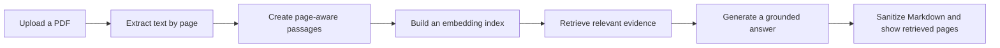

# Asfi's NoteBot

[](https://mychatbot-ykczmgemwkv3hfw9qgdqqe.streamlit.app/)


[](LICENSE)

A page-aware PDF study assistant that retrieves evidence from an uploaded
document and produces concise, student-friendly answers with retrieved page
references.

**Live deployment:** [Open Asfi's NoteBot](https://mychatbot-ykczmgemwkv3hfw9qgdqqe.streamlit.app/)

## Highlights

- Page-aware PDF extraction, chunking, retrieval, and displayed evidence pages.
- Three runtime profiles: fully local free, local app with OpenAI, and a hosted
  Cloudflare Workers AI demo.
- Definition-first hosted answers with student-oriented explanations and
  Streamlit-compatible mathematical formatting.
- Safe answer rendering with unsupported page-citation removal, common
  model-thinking removal, Markdown image neutralization, and HTML disabled for
  model-generated answers.
- Session-scoped document indexes and conversations; no database is required.
- Separate local and cloud dependency sets, so the hosted build does not install
  the 1.1 GB local Qwen answer model.
- Explicit document, request, response, concurrency, and session limits for the
  public profile.

## How it works



In free profiles, NoteBot retrieves the best passage plus a nearby passage from
the same page when available; otherwise it can use the next-best result. Paid
mode retrieves the four highest-scoring passages. Retrieved page labels show
where the app searched for evidence, but they do not guarantee that every
displayed page was used correctly by the answer model.

Each question is answered independently. The displayed chat history is not sent
to an answer model.

## Runtime profiles

| Profile | Embedding model | Answer model | Required credential | Processing boundary |
| --- | --- | --- | --- | --- |
| Local free | `BAAI/bge-small-en-v1.5` | `Qwen/Qwen2.5-1.5B-Instruct-GGUF` Q4 | None | PDF text, search, and answers remain on the computer after model downloads |
| Local app + OpenAI | `text-embedding-3-small` | `gpt-4o-mini` | `OPENAI_API_KEY` | Extracted passages, questions, and selected context are sent to OpenAI |
| Hosted demo | `BAAI/bge-small-en-v1.5` | Cloudflare Workers AI `@cf/qwen/qwen3-30b-a3b-fp8` | Server-side Cloudflare credentials | PDF text is indexed in Streamlit session memory; each question and up to two passages are sent to Cloudflare |

The public cloud entrypoint intentionally enables only free mode. It never
installs the OpenAI package or uses a shared OpenAI key.

## Document limits

| Limit | Local profiles | Hosted demo |
| --- | ---: | ---: |
| PDF size | 25 MB | 10 MB |
| PDF pages | 300 | 100 |
| Extracted characters | 2,000,000 | 500,000 |
| Indexed passages | 4,000 | 500 |
| Retrieved passages per answer | 2 free / 4 paid | 2 |
| Question attempts per Streamlit session | N/A | 12 |

Hosted request attempts count even when a provider call fails. Best-effort
per-process safeguards also allow two concurrent requests, 30 attempts per
10-minute window, and 200 attempts per UTC day. These counters reset when the
Streamlit process restarts or scales and are not a substitute for authentication
or durable rate limiting.

## Local quick start

### Prerequisites

- Python 3.11
- Internet access during installation and initial model downloads
- Approximately 2.5 GB of free disk space
- 16 GB RAM recommended for comfortable local free-mode use
- An OpenAI API key only if using the OpenAI profile

### Windows PowerShell

```powershell
git clone https://github.com/asfiahamed0404/MyChatBot.git
cd MyChatBot

py -3.11 -m venv .venv
.\.venv\Scripts\python.exe -m pip install --upgrade pip
.\.venv\Scripts\python.exe -m pip install --only-binary=:all: --extra-index-url https://abetlen.github.io/llama-cpp-python/whl/cpu "llama-cpp-python==0.3.34"
.\.venv\Scripts\python.exe -m pip install -r requirements.txt
.\.venv\Scripts\python.exe -m streamlit run .\asfi_notebot.py --server.address 127.0.0.1
```

The prebuilt Windows `llama-cpp-python` wheel is downloaded from the additional
package index shown above. Review third-party package sources before using them
in a sensitive environment.

### macOS or Linux

```bash
git clone https://github.com/asfiahamed0404/MyChatBot.git
cd MyChatBot

python3.11 -m venv .venv
./.venv/bin/python -m pip install --upgrade pip
./.venv/bin/python -m pip install -r requirements.txt
./.venv/bin/python -m streamlit run ./asfi_notebot.py --server.address 127.0.0.1
```

If a compatible wheel is unavailable, `llama-cpp-python` may compile locally
and require CMake plus a C/C++ compiler.

Open [http://127.0.0.1:8501](http://127.0.0.1:8501) if Streamlit does not open
automatically. Keep a paid-mode instance bound to loopback; do not expose it to
a LAN or forwarded port without authentication.

### Configure the OpenAI profile

Free local mode does not require a key. Copy the tracked template when using
OpenAI:

Windows PowerShell:

```powershell
Copy-Item .streamlit\secrets.toml.example .streamlit\secrets.toml
```

macOS or Linux:

```bash
cp .streamlit/secrets.toml.example .streamlit/secrets.toml
```

Then edit the ignored `.streamlit/secrets.toml` file:

```toml
OPENAI_API_KEY = "replace-with-your-openai-api-key"
```

The `OPENAI_API_KEY` environment variable takes precedence over Streamlit
Secrets. If a newly saved key appears to be ignored, check for a stale
environment variable before restarting the app.

OpenAI API billing is
[separate from a ChatGPT subscription](https://help.openai.com/en/articles/8156019).
Review the current prices on the model pages below and configure
[usage monitoring and budget alerts](https://help.openai.com/en/articles/9186755-managing-projects-in-the-api-platform).
Do not assume a budget alert is a guaranteed hard spending stop.

## Use the app

1. Choose **Free** or **Paid** when running the local entrypoint.
2. Upload a text-based PDF.
3. Select the preparation action shown for the active profile.
4. Wait for extraction, embedding, and indexing to complete.
5. Ask a focused question, such as `What is a parametric curve?`
6. Review the answer and the retrieved page labels shown beneath it.

Changing profiles clears the prepared document index and conversation. Uploaded
documents and chats are held only for the current Streamlit session.

## Deploy on Streamlit Community Cloud

The hosted profile uses the lightweight entrypoint
`cloud/streamlit_app.py` and dependencies in `cloud/requirements.txt`.

### 1. Create Cloudflare credentials

1. Sign in to the [Cloudflare dashboard](https://dash.cloudflare.com/).
2. Open **Workers AI**, choose **Use REST API**, and select Cloudflare's
   **Create a Workers AI API Token** template.
3. Restrict the token to the single account used by this app. Do not use a
   Global API Key.
4. Save the 32-character Account ID and API token securely.

See Cloudflare's current
[Workers AI REST API guide](https://developers.cloudflare.com/workers-ai/get-started/rest-api/)
for dashboard and permission details.

### 2. Push the deployment files

Before deploying, inspect the working tree and stage only the paths you have
reviewed. Use `git add path\to\file` for each intended file; do not stage the
whole repository without checking it first.

```powershell
git status --short
git diff
git diff --cached --check
git diff --cached
git commit -m "Prepare Streamlit deployment"
git fetch origin main
git log --oneline origin/main..HEAD
git diff --check origin/main..HEAD
git diff origin/main..HEAD
git push origin main
```

Run the commit only after staging the intended files. Review the staged changes
before committing and the outgoing commits before pushing. Also run a dedicated,
history-aware secret scanner: Git diffs alone are not complete secret scans.

### 3. Create the Streamlit app

1. Open [share.streamlit.io](https://share.streamlit.io) and sign in with
   GitHub.
2. Select **Create app**, then **Yup, I have an app**.
3. Set repository to `asfiahamed0404/MyChatBot`.
4. Set branch to `main`.
5. Set the entrypoint to `cloud/streamlit_app.py`.
6. In **Advanced settings**, select Python `3.11`.
7. Add the following server-side secrets with the real Cloudflare values:

   ```toml
   CLOUDFLARE_ACCOUNT_ID = "replace-with-your-32-character-account-id"
   CLOUDFLARE_API_TOKEN = "replace-with-your-workers-ai-api-token"
   ```

8. Do not add `OPENAI_API_KEY` to the public deployment.
9. Deploy the app and select the required visibility under **App settings /
   Sharing**.

Streamlit monitors the configured GitHub branch and deploys subsequent commits.
If an existing app uses the wrong Python version, changing Python requires
deleting and redeploying the app; rebooting alone does not change it. See
Streamlit's [Python upgrade guide](https://docs.streamlit.io/deploy/streamlit-community-cloud/manage-your-app/upgrade-python).

For a cleaner portfolio URL, you can choose an available custom subdomain in
[App settings](https://docs.streamlit.io/deploy/streamlit-community-cloud/manage-your-app/app-settings).
If the URL changes, update both live-app links at the top of this README.

Streamlit Community Cloud provides free app hosting. As of July 2026,
Cloudflare Workers AI includes 10,000 Neurons per day at no charge. Operations
on Workers Free fail after that daily allocation is exhausted; Workers Paid
charges for usage above the free allocation. These terms can change, so review
the current [Streamlit Community Cloud overview](https://docs.streamlit.io/deploy/streamlit-community-cloud)
and [Workers AI pricing](https://developers.cloudflare.com/workers-ai/platform/pricing/).

The first PDF preparation downloads the embedding model. Inactive Community
Cloud apps can sleep, so a cold start may take longer than a warm session.
Cloudflare applies account-level quotas in addition to this app's local
safeguards.

## Data and privacy

### Local free

PDF extraction, indexing, retrieval, and answer generation run on the local
computer. The first run downloads model artifacts from their hosting providers.
No PDF content is sent to OpenAI or Cloudflare.

### Local app + OpenAI

Preparing a document sends all extracted text passages to OpenAI's embeddings
endpoint. Each question is also embedded, and the current question plus up to
four retrieved passages are sent to the chat-completions endpoint. The app does
not include the PDF binary, filename, vector index, previous messages, or chat
history in those requests.

OpenAI states that API data is not used for training by default, while default
abuse-monitoring logs may retain content for up to 30 days. Review the current
[OpenAI API data controls](https://developers.openai.com/api/docs/guides/your-data#default-usage-policies-by-endpoint)
before processing sensitive material.

### Hosted demo + Cloudflare

The PDF is uploaded to the Streamlit server, where its extracted text and
embedding index remain in session memory. For each answer, the current question
and up to two retrieved passages are sent to Cloudflare Workers AI. The app does
not include the PDF binary, filename, vector index, previous messages, or chat
history in that request. With a very short PDF, two selected passages may contain
most or all of its extracted text.

Cloudflare states that customer inputs and outputs are not used to train or
improve its models without explicit consent. Review the current
[Workers AI data-usage policy](https://developers.cloudflare.com/workers-ai/platform/data-usage/).

Clearing NoteBot's session removes app state; it does not delete logs that an
external provider may retain under its own policy. Do not upload confidential,
regulated, or sensitive material to a public demo.

## Security notes

- Credentials are read from environment variables or Streamlit Secrets and
  remain server-side.
- The real `.streamlit/secrets.toml` file is ignored; only the placeholder
  template is tracked.
- `.gitignore` does not remove a file that was already committed. If a key is
  exposed, revoke it first, replace it, then clean repository history if needed.
  Collaborators must re-clone or reset after a history rewrite.
- Review staged changes before every push and use a dedicated secret scanner for
  stronger coverage.
- Use least-privilege provider tokens and monitor provider usage.
- Keep paid mode private and loopback-bound unless real authentication and
  persistent rate limiting are added.
- The hosted process limits are best-effort controls, not durable
  denial-of-service protection.
- Output sanitization is defense in depth and does not guarantee factual
  correctness.

## Known limitations

- Image-only and scanned PDFs require OCR before NoteBot can read them.
- Password-protected PDFs are rejected.
- PDF text extraction can distort equations, tables, diagrams, multi-column
  layouts, and reading order. See
  [pypdf's extraction limitations](https://pypdf.readthedocs.io/en/stable/user/extract-text.html).
- Answers are model-generated and can be incomplete or wrong. Verify important
  claims against the retrieved pages and original document.
- Local free answer generation is CPU-only and can be slow on older hardware.
- The app handles one prepared document per session and does not provide durable
  storage, user accounts, or cross-session history.
- Provider availability, quotas, and model behavior can change independently of
  this repository.

## Run the tests

Windows PowerShell:

```powershell
.\.venv\Scripts\python.exe -B -m unittest discover -s tests -p "test_*.py" -v
.\.venv\Scripts\python.exe -B -m pip check
```

macOS or Linux:

```bash
./.venv/bin/python -B -m unittest discover -s tests -p 'test_*.py' -v
./.venv/bin/python -B -m pip check
```

The current suite contains 30 tests covering Cloudflare API boundaries, local
usage guards, answer sanitization, mathematical delimiter normalization, and
safe Streamlit rendering.

## Troubleshooting

| Symptom | What to check |
| --- | --- |
| The hosted app asks you to sign in | Ask the app owner to make it public or invite your email address |
| A scanned PDF has little or no text | Run OCR first, then upload the searchable PDF |
| An answer is weak or unrelated | Ask a more specific question and confirm the retrieved pages contain the topic |
| Equations look incomplete | Compare with the original page; PDF extraction may have damaged mathematical layout |
| Local Qwen preparation fails | Check internet access, disk space, RAM, compiler requirements, and restart Streamlit |
| OpenAI rejects a key | Check for a stale `OPENAI_API_KEY` environment variable and verify API billing is active |
| Cloudflare returns `401` or `403` | Recreate a least-privilege Workers AI token and confirm it belongs to the configured Account ID |
| Cloudflare returns `429` | Wait for Cloudflare's provider rate or quota limit to reset; NoteBot's own limits use separate local messages |
| The hosted app is slow to start | Allow time for a cold start and the first embedding-model download |
| A Python-version change is ignored | Delete and redeploy the Community Cloud app with Python 3.11 |
| `py -3.11` cannot find Python | Install or register Python 3.11 with the Windows launcher, or invoke its `python.exe` by full path when creating `.venv`; do not substitute another major version |

## Project structure

```text
MyChatBot/
|-- asfi_notebot.py                 # Shared Streamlit application
|-- answer_safety.py                # Answer cleanup and safe math normalization
|-- cloudflare_ai.py                # Bounded Workers AI client
|-- requirements.txt                # Local free and OpenAI dependencies
|-- cloud/
|   |-- streamlit_app.py            # Community Cloud entrypoint
|   `-- requirements.txt            # Lightweight hosted dependencies
|-- tests/
|   |-- test_answer_rendering.py
|   |-- test_answer_safety.py
|   `-- test_cloudflare_ai.py
|-- .streamlit/
|   |-- config.toml
|   `-- secrets.toml.example
|-- .devcontainer/
|   `-- devcontainer.json
|-- .gitignore
|-- LICENSE
`-- README.md
```

Virtual environments, IDE settings, Python caches, logs, model weights, and the
real Streamlit secrets file are excluded from Git.

## Models and external services

This repository's MIT license covers the project code, not third-party models,
hosted services, or their separate licenses and terms.

- [BAAI/bge-small-en-v1.5](https://huggingface.co/BAAI/bge-small-en-v1.5)
- [qdrant/bge-small-en-v1.5-onnx-q](https://huggingface.co/qdrant/bge-small-en-v1.5-onnx-q) - FastEmbed ONNX artifact selected by model name, not pinned to a repository revision
- [Qwen/Qwen2.5-1.5B-Instruct-GGUF](https://huggingface.co/Qwen/Qwen2.5-1.5B-Instruct-GGUF)
- [Cloudflare Qwen3 30B A3B FP8](https://developers.cloudflare.com/workers-ai/models/qwen3-30b-a3b-fp8/)
- [OpenAI gpt-4o-mini](https://developers.openai.com/api/docs/models/gpt-4o-mini)
- [OpenAI text-embedding-3-small](https://developers.openai.com/api/docs/models/text-embedding-3-small)

## Contributing

Issues and focused pull requests are welcome. Before submitting a change, run
the full test suite, review staged files, and never include provider credentials
or private documents.

## License

Licensed under the [MIT License](LICENSE).
